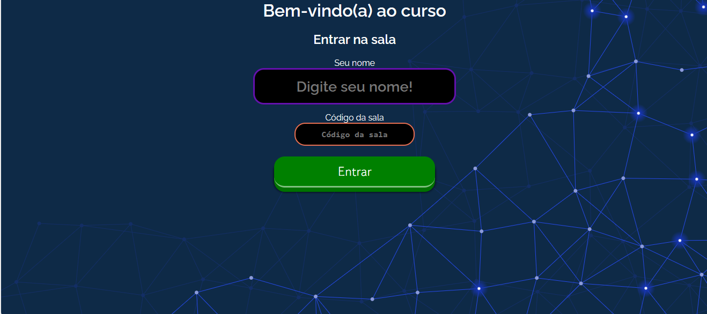
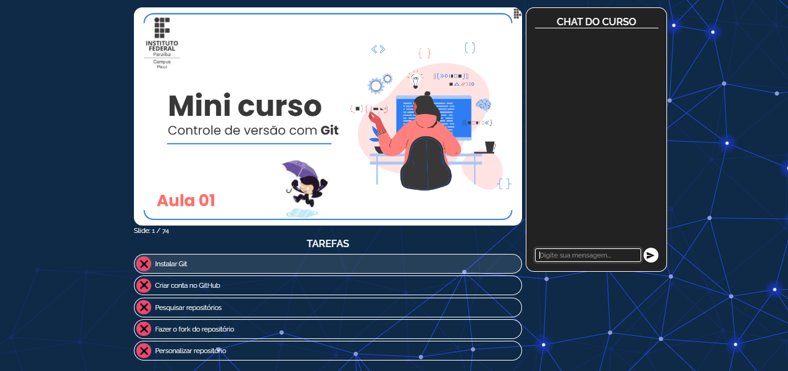
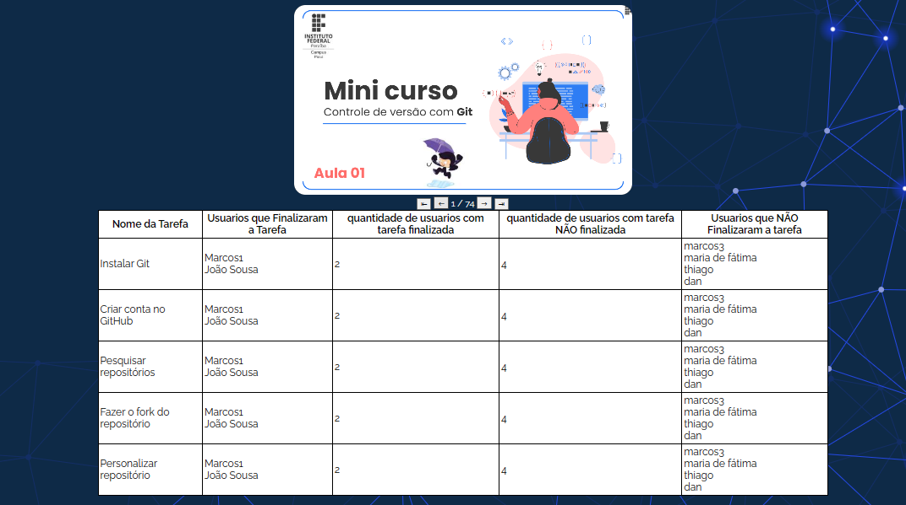

# ROOT TUTOR

Aplicação que auxilia na condunção de aulas didáticas, onde os alunos necessitam realizar atividades programadas durante uma apresentaçãoe interagir!

## Configuração

* Instalar bibliotecas necessárias
```bash
pip install -r requirements.txt
```

* Executar
```bash
python main.py
```


# Tecnologias utilizadas
- ``Flask``
- ``Python``
-  ``Javascript``
- ``HTML``
- ``CSS``
- ``Websocket``
- ``OpenAi API ``


# Tela de entrar na sala :



A aplicação dispõe, por enquanto, de uma sala com slides em pdf e passo a passoa a serem realizados


# Tela da sala:



O site, após a inserção da chave da sala, permite que você interaja na sala com um chat


 # Tela de administrador 

 

- O administrador da sala (Professor) consegue visualizar os passos que foram feito por cada aluno e os passos que faltam.
- O administrador da sala também consegue mudar os slides de forma síncrona com os slides em PDF dos usuários (alunos)


[](https://www.linkedin.com/in/darlan-almeida-92251a232/) 
[](mailto:adarlan748@gmail.com)

